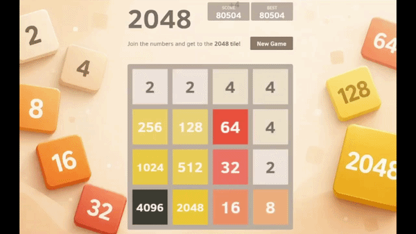

# expectimax2048bot

A 2048 bot written entirely in Python. No compiled core, no ML, no training. Just search and a good heuristic, built to see how far pure Python could actually go.



**Best run: 122,020 points, 8192 tile.** For reference, that's roughly 4x the top score on the public leaderboard of the site it plays. That run actually hit a 5,000-move safety cap while still alive, with legal moves remaining. Its true ceiling is untested.

---

## The short version

I wanted to know what a from-scratch 2048 bot could do if I refused to reach for C++. Every serious 2048 AI is compiled, because the algorithm is brutally sensitive to speed. I stayed in Python on purpose, leaned hard on a fast board representation, and let a well-tuned heuristic carry the weight that raw search depth couldn't.

It hits 8192. That surprised me, and the reason it works is more interesting than the score.

---

## How it plays

The bot runs the same four-step loop about 5,000 times per game:

1. **Read** the board
2. **Choose** a move by simulating several turns ahead
3. **Press** the arrow key
4. **Wait** for the board to settle, then repeat

Step 2 is the brain. It uses **expectimax search**, which alternates between two kinds of decision:

- **Its own move:** take the *best* of the four directions, since the bot chooses
- **The random tile spawn:** take the probability-weighted *average* across every empty cell and both tile values (90% a 2, 10% a 4), since the bot has no control over that

At the bottom of the search, every imagined board gets scored by a heuristic that measures *health*, not points: how much open space there is, whether big tiles are anchored in a corner, whether values step down in order along rows and columns, and whether neighbors are close enough to merge soon. The move whose futures score best on average is the one it plays.

---

## The specs

| | |
|---|---|
| Language | Python, standard library only |
| Algorithm | Expectimax with time-budgeted iterative deepening |
| Board representation | Single 64-bit integer, 16 cells of 4 bits |
| Move engine | Precomputed lookup tables, one per row state |
| Best score | 122,020 |
| Best tile | 8192 |
| Search depth reached | ~2 to 3 ply |
| Throughput | tens of thousands of positions per second |

### The board is one integer

The whole 4x4 grid packs into a single 64-bit int. Each of the 16 cells uses 4 bits to store the log2 of its tile value (a 2 is `1`, a 4 is `2`, up to a 32768 tile at `15`). This isn't just tidy, it's the reason the bot is viable in Python at all.

Every possible row is one of 65,536 values, so at startup the bot precomputes a lookup table: for each row, what does it become when you slide it left, and how many points does that score. A full board move becomes four table lookups and some bit shifts. Vertical moves reuse the same tables by transposing the board, and the transpose itself is done with parallel bit masks rather than a loop. That one optimization was a 3x speedup on its own.

### It searches on a clock, not a fixed depth

Early attempts used a fixed search depth and it was a disaster. The problem is that merges free up cells deeper in the search, so the number of possibilities *grows* as you look further ahead instead of shrinking. A single move could balloon into billions of positions and hang for minutes.

The fix was to search on a time budget instead. The bot searches depth 2, then 3, then 4, keeping the best move it has found so far, and stops the moment its time is up. Easy positions get searched deep, nasty ones bail out early, and no single move can ever run away. You hand it a millisecond budget and it does the most it can in that window.

---

## The interesting part: depth barely mattered

Here's the finding that made this project worth writing up.

I expected search depth to be the main lever. It wasn't even close. Giving the bot **10x more time per move moved its average search depth by less than a tenth of a ply.**

| Time budget per move | Average depth reached |
|---|---|
| 20 ms | 2.10 |
| 200 ms | 2.19 |

Ten times the thinking, for essentially the same depth. The reason is the branching factor. Each extra ply of lookahead costs roughly **48x more work** (four directions, times two possible tile values, times a dozen-ish empty cells). So going one level deeper doesn't cost twice as much, it costs fifty times as much. Time runs out almost immediately.

Which leads to the real punchline: **the bot scored 80,000 and reached 4096 at an average depth of barely 2.** It's looking one move ahead and still crushing the game. That means the strength isn't coming from the search at all. It's coming from the **heuristic**. The evaluation function, the thing that scores how healthy a board looks, is doing almost all of the work. Search is just polish on top of good taste.

If you take one thing from this project: for 2048, a great evaluation function beats a deep search, and it isn't close.

---

## How it compares to the record bots

The bots that chase world records (reaching 16384 and even 32768) run the same core algorithm this one does. Same expectimax, same corner-anchoring heuristic, same bitboard trick. The difference between them and this bot comes down almost entirely to one thing: they're written in C++.

| | This bot (Python) | Record bots (C++) |
|---|---|---|
| Positions per second | ~tens of thousands | ~10 million |
| Search depth | ~2 to 3 | ~6 to 8 |
| Reaches 8192 | yes | ~99% of games |
| Reaches 16384 | not yet | ~90% of games |
| Reaches 32768 | no | ~1 in 3 games |

The gap is real, but look at the exchange rate. Going from a very good bot to a near-record bot means jumping from depth 2-3 to depth 6-8, which costs a **100x speedup** in a compiled language to buy roughly **four extra plies**. That is a punishing trade, and it's the same lesson as the finding above: depth has vicious diminishing returns.

Which is oddly encouraging. The distance between this Python bot and a world-record bot isn't some clever insight I'm missing. It's the same machine running on a faster engine. Port the hot loop to compiled code and tune the weights against millions of games, and most of that gap closes.

---

## The part nobody warns you about: reading the game

The bot plays in a real browser against a live game. Getting the board state out of that game turned out to be the fiddliest part of the whole project.

The game looked like the standard open-source 2048, but underneath it was a completely different animal, rendering to a `<canvas>` with no readable tile elements in the page at all. The board state lived in browser storage in a specific undocumented shape, and it only updated after moves that actually changed something. Figuring out the exact storage key, the grid orientation, and how to send keypresses that the game would actually accept took a run of small diagnostic scripts (still in [`diagnostics/`](diagnostics/) if you're curious).

The nastiest surprise was the win screen. When the bot reaches 2048, the game throws up a "Keep going" overlay and silently stops accepting input. Miss it and the bot caps out around 20,700 points, one move short of continuing forever. It turned out to be a DOM button layered over the canvas, so the bot detects it and clicks it, then plays on to 4096 and 8192.

---

## Architecture

```
driver.py      the play loop, talks to the browser
  ├── browser.py   reads board state, sends keys, handles the win overlay
  └── solver.py    expectimax search with iterative deepening
        └── board.py   move simulation and the evaluation function

benchmark.py   plays full games offline, no browser, for measuring strength
```

`board.py` and `solver.py` never touch a browser. They operate on a single integer, which means the entire brain can be benchmarked at full speed against a simulated game with no browser open. That's what made it possible to actually *measure* things like the depth-vs-time finding rather than guess.

---

## Running it

Requires Python 3.10+.

```bash
git clone https://github.com/HMAC10/2048masterbot.git
cd 2048masterbot

python -m venv .venv
# Windows
.venv\Scripts\Activate.ps1
# macOS / Linux
source .venv/bin/activate

pip install -r requirements.txt
playwright install chromium
```

**Watch it play in a live browser:**

```bash
python driver.py --games 1 --budget-ms 100 --keep-open
```

**Measure its strength offline (no browser, much faster):**

```bash
python benchmark.py --games 5 --budget-ms 100
```

**Run the tests:**

```bash
pytest
```

The `--budget-ms` flag is the one dial that matters: it's the thinking time per move. Higher means marginally deeper search. As the finding above shows, don't expect miracles from cranking it.

---

## How it's tested

The move engine is the kind of code where a bug is silent. A wrong bit shift doesn't crash, it just makes the bot play slightly wrong moves that are nearly impossible to spot from the outside. So `board.py` ships with a second, deliberately slow implementation of the move logic written in plain nested lists, and the test suite checks that the fast bitboard version and the slow obvious version agree on the result and score across 2,000 random boards in all four directions. If the bit tricks are ever wrong, the tests catch it immediately.

---

## Credits

The bitboard-plus-lookup-table approach and the shape of the heuristic follow the well-known [nneonneo/2048-ai](https://github.com/nneonneo/2048-ai). Heuristic weight starting points were informed by [qpwoeirut/2048-solver](https://github.com/qpwoeirut/2048-solver). No code was copied from either; both are worth reading.

## License

MIT
